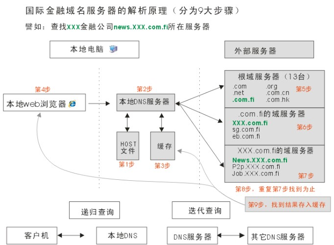
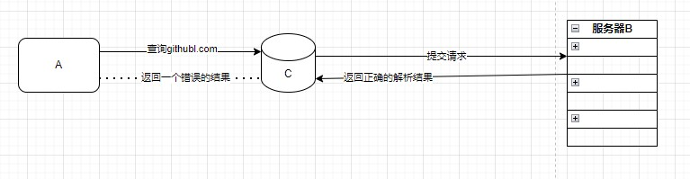

### DNS污染

> 今天按照惯例在查看Github上自己的仓库时，突然显示连接超时，随掏出手机发现手机竟可以正常访问（电脑连的上移动宽带，手机则是电信的）。脑中瞬间闪出一个想法——莫非是DNS污染？于是遂即查阅资料，予以一篇浅显的博客录之

#### 1.DNS污染的定义

DNS污染，又称为域名服务器缓存污染（DNScache pollution）或者域名服务器快照侵害（DNS cache poisoning）。DNS污染是指一些刻意制造或无意中制造出来的域名服务器分组，把域名指往不正确的IP地址。一般来说，网站在互联网上一般都有可信赖的域名服务器，但为减免网络上的交通，一般的域名都会把外间的域名服务器数据暂存起来，待下次有其他机器要求解析域名时，可以立即提供服务。一旦有相关网域的局域域名服务器的缓存受到污染，就会把网域内的电脑导引往错误的服务器或服务器的网址。其实总结起来用大白话说就是，通过DNS污染导致客户端收到错误的IP地址，从而无法正常访问目标网站。

#### 2.DNS污染的原理

首先我们来看一下电脑是如何访问目标网站的，如图1-DNS域名解析



​                                                                                                   图1-DNS域名解析

1. 本地客户机提出域名解析请求，查找本地HOST文件后将该请求发送给本地的域名服务器。

2. 将请求发送给本地的域名服务器。

3. 当本地的域名服务器收到请求后，就先查询本地的缓存。

4. 如果有该纪录项，则本地的域名服务器就直接把查询的结果返回浏览器。

**5. 如果本地DNS缓存中没有该纪录，则本地域名服务器就直接把请求发给根域名服务器。**

6. 然后根域名服务器再返回给本地域名服务器一个所查询域（根的子域）的主域名服务器的地址。

7. 本地服务器再向上一步返回的域名服务器发送请求，然后接受请求的服务器查询自己的缓存，如果没有该纪录，则返回相关的下级的域名服务器的地址。

8. 重复第7步，直到找到正确的纪录。

9. 本地域名服务器把返回的结果保存到缓存，以备下一次使用，同时还将结果返回给客户机

而DNS污染则是在第五步产生的，我们举一个浅显的例子

假设A为用户端，B为DNS服务器，C为A到B链路的一个节点的网络设备（路由器，交换机，网关等等）。然后我们来模拟一次被污染的DNS请求过程。A向B构建UDP连接，然后，A向B发送查询请求，查询请求内容通常是：“github.com”，这一个数据包经过节点设备C继续前往DNS服务器B；然而在这个过程中，C通过对数据包进行特征分析（远程通讯端口为DNS服务器端口，激发内容关键字检查，检查特定的域名如上述的“github.com",以及查询的记录类型"A记录"），从而立刻返回一个错误的解析结果（如返回了"A 123.123.123.123"），众所周知，作为链路上的一个节点，C机器的这个结果必定会先于真正的域名服务器的返回结果到达用户机器A(很多被污染的目标网站服务器都位于国外)，而目前我们的DNS解析机制有一个重要的原则，就是**只认第一**，因此C节点所返回的查询结果就被A机器当作了最终返回结果，用于构建链接。如图2-DNS污染原理。



​                                            图2-DNS污染原理

#### 3.检测DNS污染

由于DNS污染会返回一个虚假的IP地址，而当我们访问一个根本不存在的域名时，如果正常来说肯定不会有任何回答，然而当在域名被DNS污染后则会返回一个虚假的IP地址。这样我们就进行了一个简单的DNS污染检测。下面我将以一个简单的实验进行说明，为了方便理解，我先介绍一下用到的命令。

```cmd
nslookup#查询 DNS（域名系统）记录以解析 Internet 中的域名到相应的 IP 地址
ipconfig /flushdns#刷新DNS解析缓存
```

我们先选取一个不存在的国外IP作为域名服务器进行解析，然后用nslookup进行网络诊断

~~~ cmd
C:\>nslookup facebook.com 101.101.153.1

　　DNS request timed out.

　　timeout was 2 seconds.

　　Can't find server name for address 101.101.153.1: Timed out

　　Server: UnKnown

　　Address: 101.101.153.1

　　Name: twitter.com

　　Address: 60.41.5.18
~~~

接着我们选取一个可正常访问的域名进行网络诊断

~~~cmd
　　C:\>nslookup www.baidu.com 101.101.153.1

　　DNS request timed out.

　　timeout was 2 seconds.

　　Can't find server name for address 101.101.153.1: Timed out

　　Server: UnKnown

　　Address: 101.101.153.1

　　DNS request timed out.

　　timeout was 2 seconds.

　　DNS request timed out.

　　timeout was 2 seconds.

　　Request to UnKnown timed-out
~~~

这里我们可以看出twitter.com这个域名以经被DNS污染了

#### 4.DNS污染解决方案

* VPN技术

* 手动修改**HOST**文件

  这里着重讲一下这个方法，也是我常用的方法。先介绍一下HOST文件的作用

  1. 加快域名解析：当你访问一个网址时，系统会首先检查hosts文件中的条目，如果找到对应的IP地址，则直接使用该地址去连接目标服务器，而不通过DNS服务器进行查询，从而提高域名解析速度。

  2.  本地化域名解析：在局域网环境下，可以为内部网络的设备配置hosts文件来实现快速、便捷的本地域名解析，例如将内部服务器的域名映射到其局域网IP地址。

  3. 跳过特定DNS设置：对于某些需要绕过公共DNS或CDN（内容分发网络）以访问特定版本或测试环境的网站，可以通过修改hosts文件指定要连接的服务器IP。

  4. 过滤或屏蔽网站：用户还可以利用hosts文件将不想访问或者可能有害的网站域名指向无效的IP地址，比如127.0.0.1（本地环回地址），以此达到拦截恶意网站、广告服务器等目的。

  5. 测试与调试：开发人员经常用hosts文件临时重定向某个域名至本地开发环境的IP地址上，以便于测试Web应用或服务。

当客户端需要访问一个目标网站时，会先在本地的HOST文件里先查询有没有相关的记录，如果有则不必通过DNS服务器解析。这样的设计本意是为了提高网站的访问速度和绕过恶意网站，而我们则可以通过提前设好HOST文件内的内容，从而避免收到“毒苹果”。

HOST文件位于C:\windows\System32\drivers\etc中，这是我的HOST文件内容

~~~
140.82.113.4 github.com
140.82.113.4  gist.github.com
140.82.114.10 nodeload.github.com
199.232.69.194 github.global.ssl.fastly.net
~~~

P.S这里可能会遇到一些修改host文件的困难，只需要将host文件复制到桌面，然后修改桌面文件最后替换etc文件下的host文件

#### 5.常用工具

IP地址查询网站：https://www.ipaddress.com/ip-lookup

绘    图   工   具： https://app.diagrams.net/


#### 引用

>* [DNS的解析，查询，调度原理是什么？什么是DNS劫持，污染？如何监控？_监测dns劫持的手段-CSDN博客](https://blog.csdn.net/DeveloperFire/article/details/128776725?ops_request_misc=%7B%22request%5Fid%22%3A%22170687075416800213031529%22%2C%22scm%22%3A%2220140713.130102334..%22%7D&request_id=170687075416800213031529&biz_id=0&utm_medium=distribute.pc_search_result.none-task-blog-2~all~sobaiduend~default-1-128776725-null-null.142^v99^pc_search_result_base5&utm_term=DNS污染原理&spm=1018.2226.3001.4187)
>* [DNS污染（国内的服务器(非DNS)） - TrustNature - 博客园 (cnblogs.com)](https://www.cnblogs.com/trustnature/articles/3205620.html)
>* [通过开源程序同时解决DNS劫持和DNS污染的问题-月光博客 (williamlong.info)](https://www.williamlong.info/archives/2184.html)
